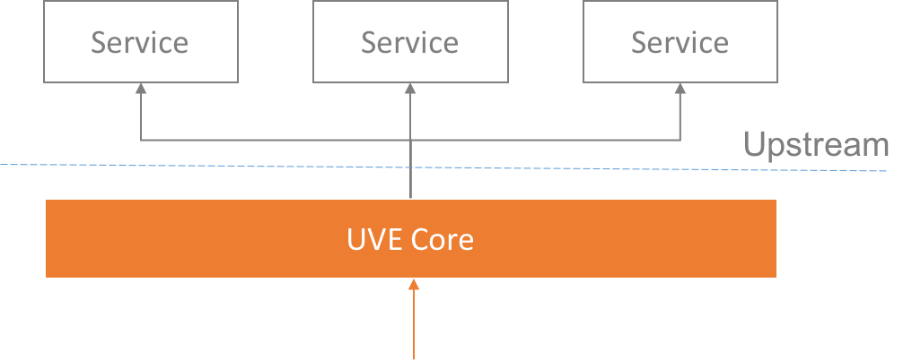

# UVE Core Framework

UVE Core Framework is a lightweight, ad hoc web service framework implemented with Lua/Nginx.

# Purpose 

This framework is NOT a general purpose web framework, but dedicated to coordinate backend(upstream) services. 

